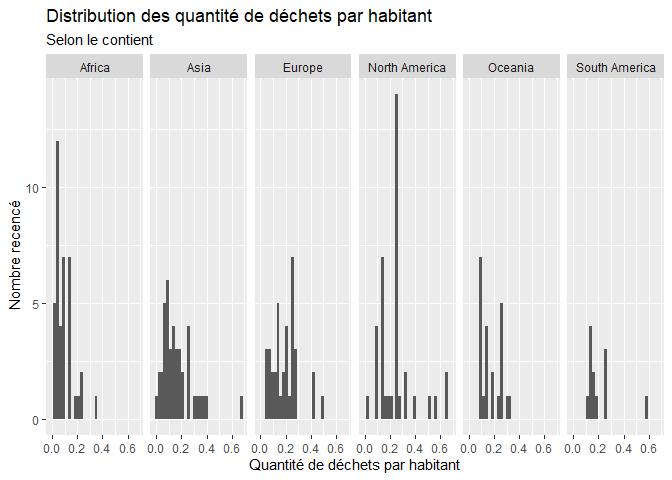

Lab 02 - Plastic waste
================
Shana Giroux
22 septembre 2025

## Chargement des packages et des données

``` r
library(tidyverse) 
```

``` r
plastic_waste <- read_csv("data/plastic-waste.csv")
```

Commençons par filtrer les données pour retirer le point représenté par
Trinité et Tobago (TTO) qui est un outlier.

``` r
plastic_waste <- plastic_waste %>%
  filter(plastic_waste_per_cap < 3.5)
```

## Exercices

### Exercise 1

``` r
ggplot(plastic_waste,aes(x=plastic_waste_per_cap))+
  geom_histogram()+
  facet_grid(~continent)
```

    ## `stat_bin()` using `bins = 30`. Pick better value with `binwidth`.

<!-- -->

On peut voir en comparant les continent en terme de déchets plastiques
qu’il y a moins d’habitants en Océanie et en Amérique du Sud que sur les
autres continents. De plus, sur chaque continent, on peut remarquer
qu’il y a une certaine quantitié de déchets par habitant qui revient
plus fréquemment.  
\### Exercise 2

``` r
ggplot(plastic_waste,aes(x=plastic_waste_per_cap,fill=continent))+
  geom_density(alpha=0.4)
```

<!-- -->

Le réglage de la couleur et de la transparence ne sont pas au même
endroit parce que la couleur est dépendante d’une variable, alors que la
transparence est indépendante, elle ne dépend pas d’une variable.

### Exercise 3

Boxplot:

``` r
ggplot(plastic_waste,aes(x=continent, y=plastic_waste_per_cap))+
  geom_boxplot()
```

<!-- -->

Violin plot:

``` r
ggplot(plastic_waste,aes(x=continent, y=plastic_waste_per_cap))+
  geom_violin()
```

<!-- -->

Les violin plots permettebt de voir la répartition des données à
l’intérieur de la boîte et, ainsi, pouvoir mieux se représenter la
distribution des données.

### Exercise 4

``` r
ggplot(plastic_waste,aes(x=plastic_waste_per_cap, y=mismanaged_plastic_waste_per_cap,color=continent))+
  geom_point()
```

<!-- -->

On peut remarquer sur le graphe en général que plus la quantité de
déchet augmente, plus la quantité de déchet non gérés augmente. Il
s’agit d’une relation proportionnelle.

Selon les différents continents, on peut apercevoir que les continents
les plus développés, tels que l’Europe et l’Amérique du Nord, ont une
meilleure gestion des déchets pour un même niveau de quantité de déchets
que les continents moins développés, tels que l’Asie et l’Afrique.

### Exercise 5

``` r
ggplot(plastic_waste, aes(x=plastic_waste_per_cap, y=total_pop))+ 
  geom_point()
```

    ## Warning: Removed 10 rows containing missing values or values outside the scale range
    ## (`geom_point()`).

<!-- -->

``` r
ggplot(plastic_waste, aes(x=plastic_waste_per_cap, y=coastal_pop))+ 
  geom_point()
```

<!-- -->

Il semble y avoir une relation plus forte entre la quantité de déchets
plastiques par habitant et le nombre total d’habitants. En effet, dans
le premier graphe, il y a moins de données abérrantes, les données sont
beaucoup plus raprochées les unes des autres.

## Conclusion

Recréez la visualisation:

``` r
# insert code here
```
