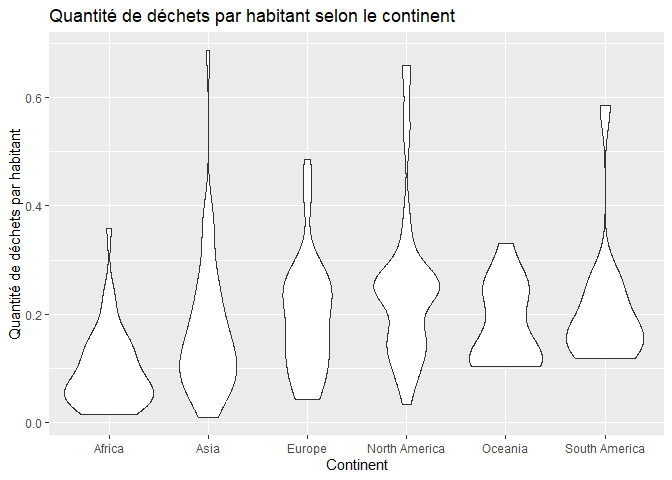

Lab 02 - Plastic waste
================
Shana Giroux
22 septembre 2025

## Chargement des packages et des données

``` r
library(tidyverse) 
```

``` r
plastic_waste <- read_csv("data/plastic-waste.csv")
```

Commençons par filtrer les données pour retirer le point représenté par
Trinité et Tobago (TTO) qui est un outlier.

``` r
plastic_waste <- plastic_waste %>%
  filter(plastic_waste_per_cap < 3.5)
```

## Exercices

### Exercise 1

``` r
ggplot(plastic_waste,aes(x=plastic_waste_per_cap))+
  geom_histogram()+
  facet_grid(~continent)+
  labs(title="Distribution des quantité de déchets par habitant",subtitle="Selon le contient", x="Quantité de déchets par habitant", y=" Nombre recencé")
```

    ## `stat_bin()` using `bins = 30`. Pick better value with `binwidth`.

<!-- -->

On peut voir en comparant les continent en terme de déchets plastiques
qu’il y a moins d’habitants en Océanie et en Amérique du Sud que sur les
autres continents. De plus, sur chaque continent, on peut remarquer
qu’il y a une certaine quantitié de déchets par habitant qui revient
plus fréquemment.

### Exercise 2

``` r
ggplot(plastic_waste,aes(x=plastic_waste_per_cap,fill=continent))+
  geom_density(alpha=0.4)+
  labs(title="Densité de la quantité de déchets par habitant", subtitle="Selon le continent", x="Quantité de déchets par habitant", y="Densité", color="Continent")
```

<!-- -->

Le réglage de la couleur et de la transparence ne sont pas au même
endroit parce que la couleur est dépendante d’une variable, alors que la
transparence est indépendante, elle ne dépend pas d’une variable.

### Exercise 3

Boxplot:

``` r
ggplot(plastic_waste,aes(x=continent, y=plastic_waste_per_cap))+
  geom_boxplot()+
  labs(title="Quantité de déchets par habitant selon le continent", x="Continent", y="Quantité de déchets par habitant")
```

<!-- -->

Violin plot:

``` r
ggplot(plastic_waste,aes(x=continent, y=plastic_waste_per_cap))+
  geom_violin()+
  labs(title="Quantité de déchets par habitant selon le continent", x="Continent", y="Quantité de déchets par habitant")
```

<!-- -->

Les violin plots permettent de voir la répartition des données à
l’intérieur de la boîte et, ainsi, pouvoir mieux se représenter la
distribution des données.

### Exercise 4

``` r
ggplot(plastic_waste,aes(x=plastic_waste_per_cap, y=mismanaged_plastic_waste_per_cap,color=continent))+
  geom_point()+
  labs(title="Relation entre la quantié de déchets et la quantité de déchets non gérés", subtitle="Selon le continent", x="Quantité de déchets", y="Quantité de déchets non gérés", color="Continent")
```

<!-- -->

On peut remarquer sur le graphe en général que plus la quantité de
déchet augmente, plus la quantité de déchet non gérés augmente. Il
s’agit d’une relation proportionnelle.

Selon les différents continents, on peut apercevoir que les continents
les plus développés, tels que l’Europe et l’Amérique du Nord, ont une
meilleure gestion des déchets pour un même niveau de quantité de déchets
que les continents moins développés, tels que l’Asie et l’Afrique.

### Exercise 5

``` r
ggplot(plastic_waste, aes(x=plastic_waste_per_cap, y=total_pop))+ 
  geom_point()+
  labs(title="Quantité de déchets par habitant vs nombre total d'habitants", x="Quantité de déchets plastiques par habitant", y="Nombre total d'habitants")
```

    ## Warning: Removed 10 rows containing missing values or values outside the scale range
    ## (`geom_point()`).

<!-- -->

``` r
ggplot(plastic_waste, aes(x=plastic_waste_per_cap, y=coastal_pop))+ 
  geom_point()+
  labs(title="Quantité de déchets par habitant vs nombre total d'habitants vivant près d'une côte", x="Quantité de déchets plastiques par habitant", y="Nombre total d'habitants vivant près d'une côte")
```

<!-- -->

Il semble y avoir une relation plus forte entre la quantité de déchets
plastiques par habitant et le nombre total d’habitants. En effet, dans
le premier graphe, il y a moins de données abérrantes, les données sont
beaucoup plus raprochées les unes des autres.

## Conclusion

Recréez la visualisation:

``` r
plastic_waste_coastal <- plastic_waste %>% 
  mutate(coastal_pop_prop = coastal_pop / total_pop) %>%
  filter(plastic_waste_per_cap < 3)

ggplot(plastic_waste_coastal, aes(x=coastal_pop_prop, y=plastic_waste_per_cap, color=continent))+
  geom_point()+
  labs(title= "Quantité de déchets plastiques vs Proportion de la population côtière", subtitle= "Selon le continent", x="Proportion de la population côtière (Coastal / total population)", y="Nombre de déchets plastiques par habitant", color= "Continent")+
  geom_smooth(method="loess",se= TRUE, color="black")
```

    ## `geom_smooth()` using formula = 'y ~ x'

    ## Warning: Removed 10 rows containing non-finite outside the scale range
    ## (`stat_smooth()`).

    ## Warning: Removed 10 rows containing missing values or values outside the scale range
    ## (`geom_point()`).

<!-- -->

Sur ce graphe, on peut voir que, malgré que la courbe de tendance montre
la tendance générale des points, il y a beaucoup de données qui sont
loin de cette courbe. Donc, il est difficile de prévoir une tendance
générale entre la quantitié de déchets plastiques et la proportion de la
population côtière.
